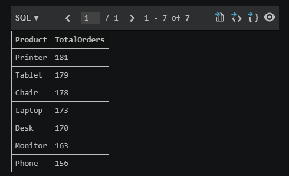
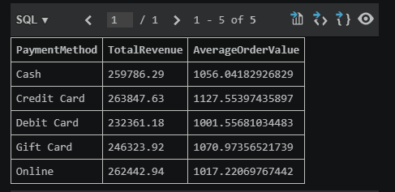
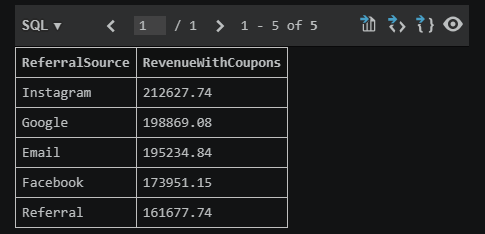

# DecodeLabs E-Commerce SQL Data Analysis (Project 3)

## 📌 Project Overview

This repository contains the SQL data analysis phase for the DecodeLabs Data Analytics Internship. Building upon the data cleaning and exploratory analysis completed in previous milestones, this project transitions the cleaned transactional dataset into a relational database structure to extract actionable business insights using structural queries.

---

## ⚙️ Core Core Analytical Skills Applied

Following the structural execution rules outlined in the Industrial Training Kit (FROM → WHERE → GROUP BY → SELECT → ORDER BY), the queries in this project demonstrate mastery over:
* **Data Filtering & Retrieval:** Isolating rows based on strict operational and conditional metrics.
* **Categorical Bucketing:** Utilizing `GROUP BY` to aggregate individual customer actions into clean business segments.
* **Financial Aggregation:** Calculating key performance indicators (KPIs) via functions like `COUNT()`, `SUM()`, and `AVG()`.

---

## 🔍 Key Business Metrics Analyzed

1. **Product Performance:** Identifying our best-selling items by total volume of consumer orders.
2. **Financial Revenue Breakdown:** Evaluating total generated revenue and average transaction values relative to different payment methods.
3. **Marketing ROI Analysis:** Monitoring the financial impact of promotional campaigns by tracking revenues linked explicitly to marketing coupon codes.

---

## 📁 Repository Structure

* `SQL_Project3.sql`: The complete production script containing documented queries and declarative logic breakdowns.
* `Cleaned_Dataset.xlsx`: The foundational e-commerce dataset utilized for generating results.
* `Result1.png`, `Result2.png`, `Result3.png`: Screenshots displaying the actual verified dataset outputs generated from the database execution.

---

### 1. Product Performance (Best-Sellers)
Here is the screenshot of the query execution and the output:

### 2. Financial Revenue Breakdown
Here is the screenshot of the query execution and the output:

### 3. Marketing ROI Analysis (Coupon Impact)
Here is the screenshot of the query execution and the output:

